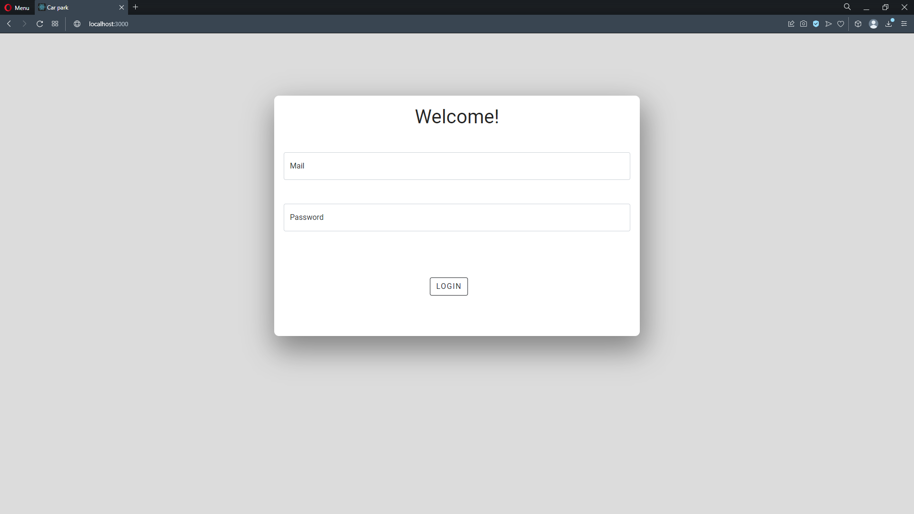
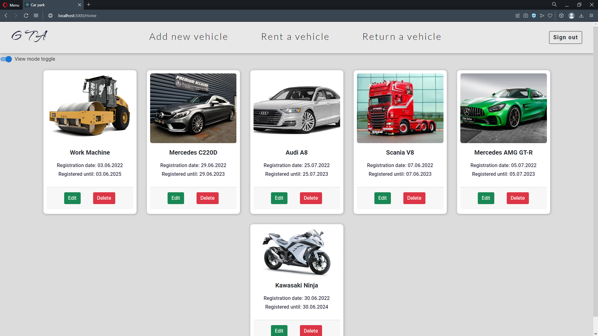
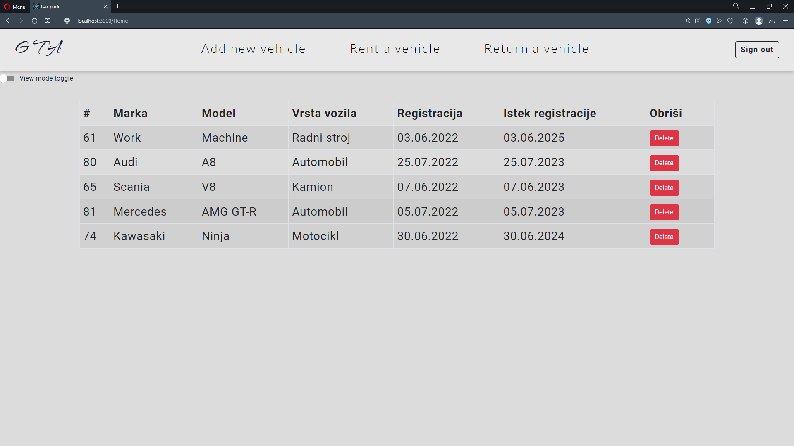
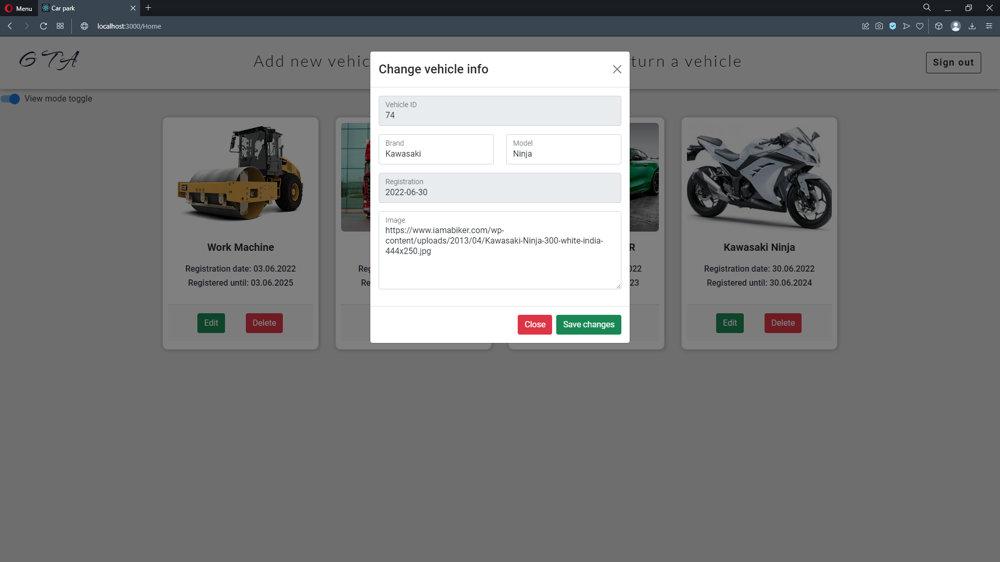
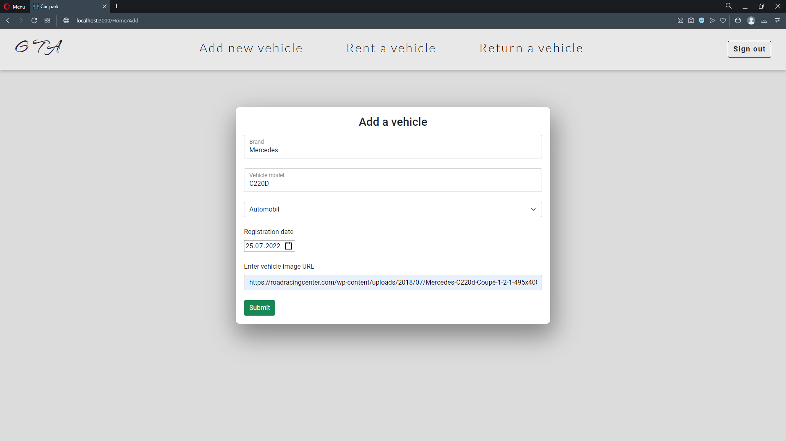
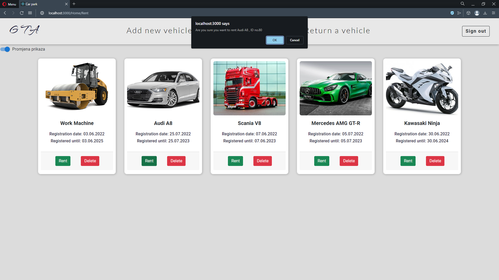
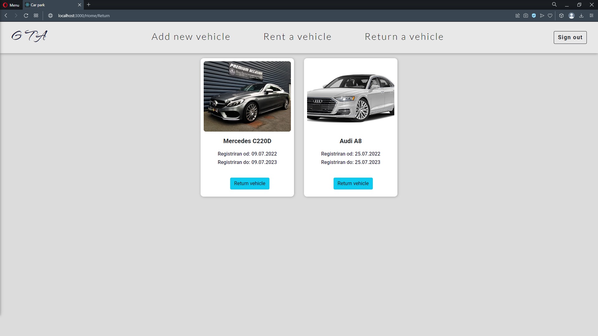

# My Car park project

This is a project that I made while learning ReactJS. 
It's a simple React app which provides features like login, 
vehicle add, rent a vehicle and return a vehicle. 
It is also possible to view the vehicles in "card" mode or "datatable" mode. 

The registration expiration date is calculated automatically based on the vehicle type. 
If the vehicle is a car or a truck, the registration expires in 1 year.
If it's a motorcycle, it expires in 2 years, and if it's a heavy work vehicle, the expiration date is in 3 years.

I really liked this project because I learned the fundamentals of ReactJS, benefits of being able to
go through the pages without refreshing, using functions that makes the app making so much easier etc.

## Things to implement

Next thing I'll implement on this page is better authentication system and graphical statistics

## Images

### Login screen

### Home page

### Toggle view mode

### Edit vehicle

### Add a vehicle

### Rent a vehicle

### Return a vehicle

##

### Made by: Tin Vukšan

